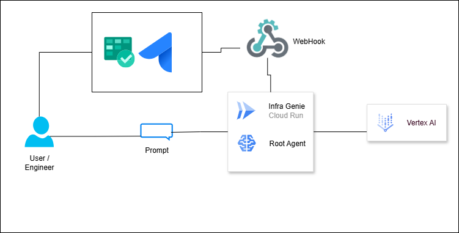
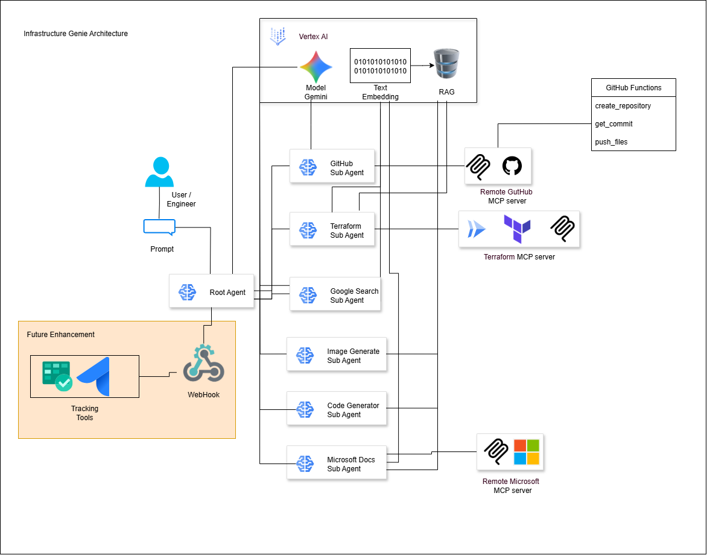
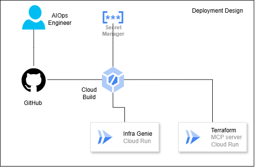

# Infrastructure Genie

## Project Overview

**Infrastructure Genie** is an intelligent automation project leveraging Google's Generative AI (GenAI) agents to streamline infrastructure management, code generation, and DevOps workflows. It acts as a smart orchestrator, capable of understanding complex requests, interacting with various tools and APIs, and automating tasks across different platforms.

**Key Features:**
*   **Intelligent RAG (Retrieval Augmented Generation):** Accesses and synthesizes information from diverse sources (e.g., documentation, codebases) to inform agent decisions.
*   **Diagram Generation:** Automates the creation of technical diagrams based on infrastructure descriptions or code analysis.
*   **Code Compliance & Guardrails:** Integrates with compliance APIs to ensure generated or modified code adheres to predefined standards.
*   **Automated Code Modification & CI/CD:** Handles end-to-end code changes, Git operations, Pull Request creation, and CI/CD pipeline management triggered by external events (e.g., Azure DevOps webhooks).

### High-Level Architecture

For a visual overview of the High-Level Infrastructure Genie's architecture, refer to the diagram below:



## Project Setup

### Prerequisites

Ensure you have the following installed on your system:
*   **Python:** Version 3.11 (recommended).
*   **`uv`:** A fast Python package installer and resolver. Install via `pip install uv`.
*   **Google Cloud CLI (`gcloud`):** Authenticated and configured for your GCP project.
*   **Docker:** For building and running container images.
*   **Git:** For version control.

### Cloning the Repository

```bash
git clone https://github.com/your-repo/infrastructure-genie.git
cd infrastructure-genie
```

### Installing Dependencies

Navigate to the project root and use `uv` to install all required dependencies:

```bash
uv sync
```

### Environment Variables

Both the main `infrastructure-genie` agent and the `galaxy_agent` rely on environment variables for configuration and authentication. It is highly recommended to use a `.env` file for local development and Google Secret Manager for production deployments.

**Common Variables (for main `infrastructure-genie` agent):**

*   `GOOGLE_CLOUD_PROJECT`: Your Google Cloud Project ID.
*   `GOOGLE_CLOUD_LOCATION`: The GCP region (e.g., `europe-west4`).
*   `GOOGLE_GENAI_USE_VERTEXAI`: Set to `True` to use Vertex AI for Gemini models, `False` for Google AI Studio.
*   `GOOGLE_API_KEY`: Your Google Gemini API Key (if `GOOGLE_GENAI_USE_VERTEXAI` is `False`).


## Agents and Their Usage

This project comprises two main agent applications, designed to operate either independently or in conjunction for comprehensive automation.

### 1. Main `Infrastructure Genie` Agent

*   **Location:** `app/` directory.
*   **Purpose:** This is the core intelligent orchestrator for infrastructure-as-code tasks. It leverages various specialized tools and RAG capabilities to understand requests, generate diagrams, check compliance, and provide intelligent responses.
*   **Key Components & Tools:**
    *   `rag_enabled_agents.py`: Defines the main agent and integrates various RAG-powered specialists (GitHub, Microsoft Learn, Terraform docs, general search).
    *   `diagram_generator_tool.py`: Tool for generating infrastructure diagrams.
    *   `compliance_api.py`: Integrates with compliance guardrails.
    *   `mcp_github.py`: Tools for interacting with GitHub repositories.

### Agent Breakdown:

Here's a detailed look at the specialized agents within the `Infrastructure Genie` and their roles:

1.  **`github_sub_agent` (`github_specialist`)**:
    *   **Purpose**: Extracts information from GitHub repositories using `create_github_mcp()`.
    *   **Focus**: Repository architecture, tech stack, deployment configurations for diagram generation.
    *   **Output**: `github_info` in session state.

2.  **`microsoft_sub_agent` (`microsoft_specialist`)**:
    *   **Purpose**: Retrieves information from Microsoft Learn documentation using `create_microsoft_learn_mcp()`.
    *   **Focus**: Azure service details, architecture patterns, component relationships, configurations, and best practices for diagram generation.
    *   **Output**: `microsoft_info` in session state.

3.  **`terraform_sub_agent` (`terraform_specialist`)**:
    *   **Purpose**: Works with Terraform documentation and generates infrastructure-as-code using `create_terraform_docs_mcp()`.
    *   **Focus**: Generating Terraform resource blocks, configurations, and providers; explicitly generates code, not diagrams.
    *   **Output**: `terraform_info` in session state.

4.  **`search_sub_agent` (`search_specialist`)**:
    *   **Purpose**: A general technical search specialist using `google_search`.
    *   **Focus**: General technical knowledge, best practices, and architecture patterns when other specialists lack specific information.
    *   **Output**: `search_info` in session state.

5.  **`image_generation_sub_agent` (`image_generation_specialist`)**:
    *   **Purpose**: Generates technical images/diagrams using an AI-driven approach via `generate_technical_image`.
    *   **Focus**: Analyzing context (GitHub, Microsoft, search info) to identify cloud providers, services, architecture patterns, and data flows, then generating Python diagrams code.
    *   **Output**: `image_result` (status) in session state.

6.  **`diagrams_expert_agent` (`diagrams_expert`)**:
    *   **Purpose**: A RAG-powered diagram specialist with code generation capabilities, preferred for diagram requests.
    *   **Focus**: Uses RAG knowledge to generate accurate Python code for professional technical diagrams.

7.  **`code_generator_agent` (`code_generator_specialist`)**:
    *   **Purpose**: Creates complete applications, APIs, and infrastructure code.
    *   **Focus**: Uses GitHub examples, Microsoft docs, and Terraform resources for code generation.

8.  **`root_agent` (`infrastructure_genie`)**:
    *   **Purpose**: The main orchestrator for the entire `infrastructure_genie` application. It coordinates and delegates tasks to the specialized sub-agents based on the user's request.
    *   **Instruction**: Provides a comprehensive overview of its capabilities (diagrams, code generation, research) and defines a clear priority order for delegating tasks to its specialized tools/sub-agents.
    *   **Tools**: Uses `AgentTool` to wrap all the specialized sub-agents, allowing the `root_agent` (an `LlmAgent`) to call them as tools.

### Low-Level Architecture

*(A detailed diagram showing the interaction between the `root_agent` and its specialized sub-agents, including how `AgentTool` is used for delegation and how data flows through `session.state` between them. It should illustrate the internal components of the `root_agent` and how it calls the `AgentTool`s to invoke the sub-agents.)*




#### Running Locally

Navigate to the project root and run the FastAPI application:

```bash
uv run app.server:app --host 0.0.0.0 --port 8080
```


## Deployment

This project uses Google Cloud Run for deploying the main `infrastructure-genie` agent. CI/CD is managed via Google Cloud Build.

*   **Cloud Run:** Serverless platform for containerized applications.
*   **Google Cloud Build:** Automates the build and deployment process.

Deployment configurations are located in the `.cloudbuild/` directory (e.g., `staging.yaml`, `deploy-to-prod.yaml`). These files define the steps for building the Docker image and deploying it to Cloud Run.

**Environment Variable Management for Deployment:**

For production deployments, sensitive environment variables (like PATs and API keys) should be securely managed using Google Secret Manager and referenced in your Cloud Build configurations.

### DevOps Workflow Architecture




## Testing

To run local tests for the main `infrastructure-genie` agent:

```bash
uv run pytest
```

(More detailed testing instructions can be found in the `tests/` directory READMEs.)